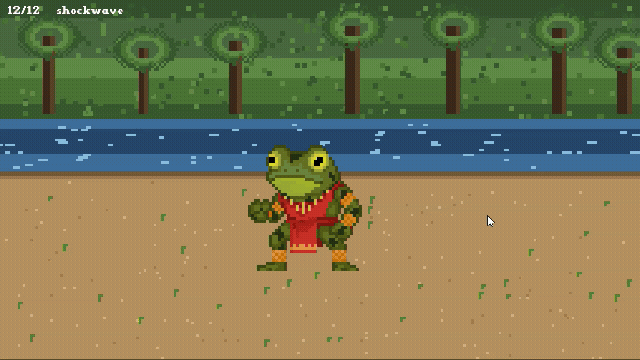
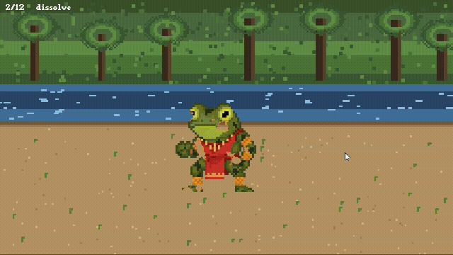
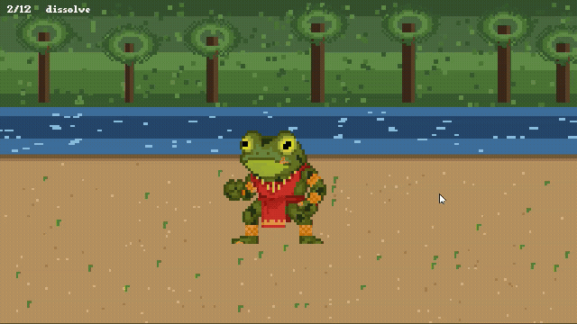

# 🟢 Juice Shaders Lite — Free Game-Feel Shaders for Godot 4

Three drop-in 2D shaders that add instant "juice" to your Godot 4 game. Free and
MIT-licensed — a taste of the full [**Juice Shaders**](https://janeduardo19.itch.io/) pack (12 effects).

| Hit Flash | Outline | Dissolve |
|---|---|---|
|  |  |  |

## What's included (free)
- **hit_flash** — flash a sprite to a solid colour when it takes damage
- **outline** — clean pixel outline for hover/selection states
- **dissolve** — burn a sprite away (or in) with a glowing edge

All plain `canvas_item` shaders. Light on mobile/web. Tested on Godot 4.2–4.4.

## Install
**From the Godot editor:** AssetLib tab → search "Juice Shaders Lite" → Download → Install.

**Manually:** copy the `addons/juice_shaders_lite/` folder into your project, then
add a **ShaderMaterial** to any Sprite2D and load a `.gdshader` from its `shaders/`
folder. Each shader's header comment explains its parameters and how to animate it.

## Get the full pack (12 shaders)
**Juice Shaders** adds 9 more: **CRT · shockwave · water · palette remap · dither ·
shine sweep · pixelate · wind sway · grayscale fade** — fully documented, with
copy-paste GDScript for every effect.

### 👉 [**Get all 12 on itch.io**](https://janeduardo19.itch.io/)  *(update to the exact pack URL)*

---

License: [MIT](LICENSE). Made by **Jan Eduardo** ([janeduardo19](https://janeduardo19.itch.io/)),
maker of the folklore deckbuilder *Sinless Land*.
